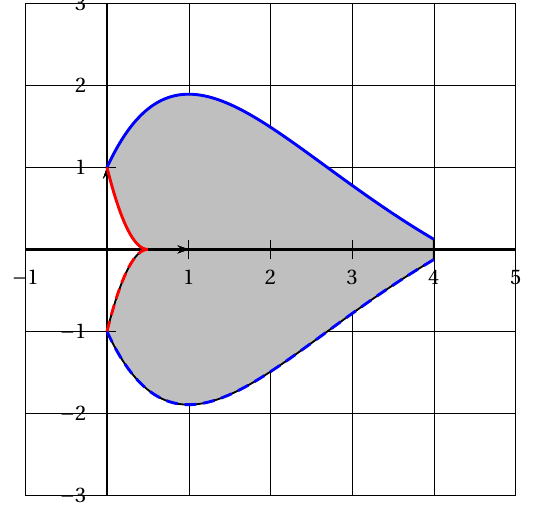
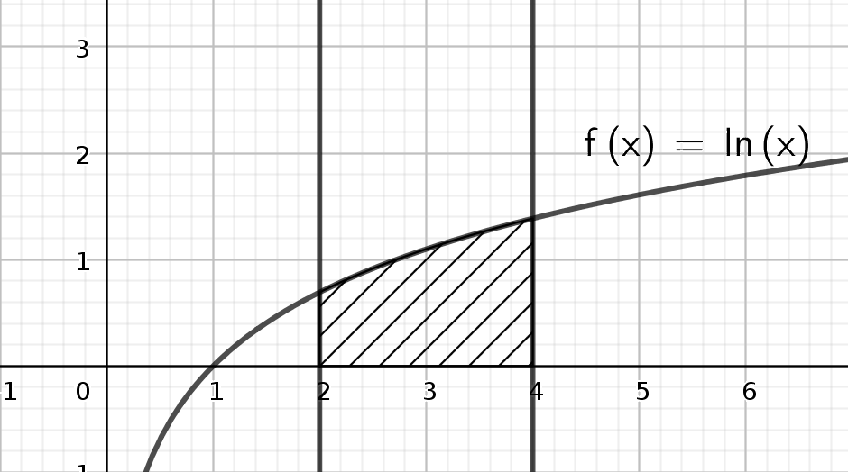
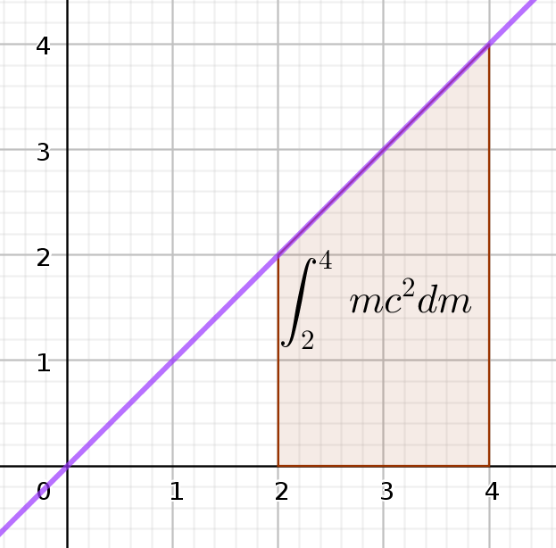
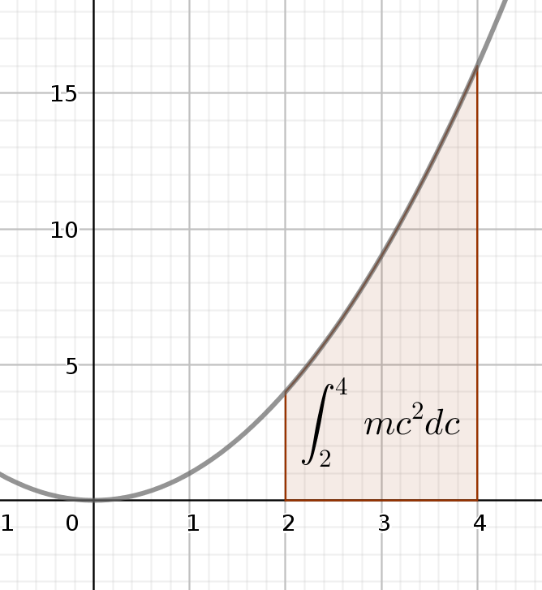
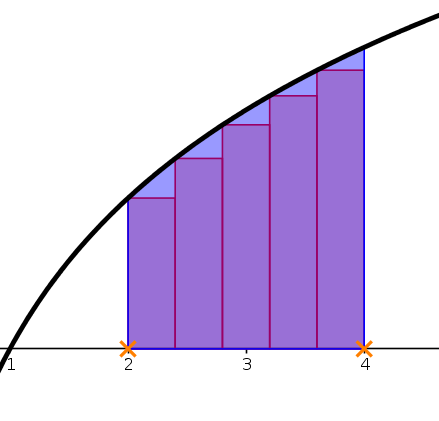
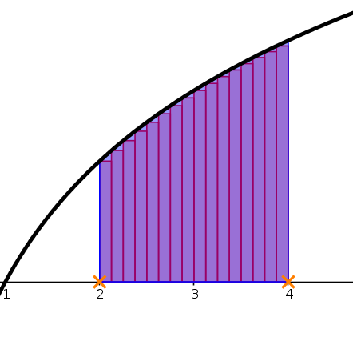
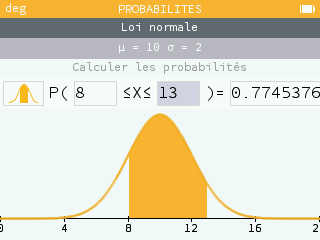

# Terminales ES - Introduction aux intégrales

**But : notion d'intégrales et d'aires, maîtrise de la notation, un algorithme, estimation graphique. Le calcul d'intégrales fera l'objet d'un autre document.**

## De quoi parle-t-on?   
On connaît toute une série de formules pour calculer des aires. Par exemple, l'aire d'un rectangle est la $L \times l$, celle d'un triangle $\frac{b \times h}{2}$, celle d'un cercle $\pi R^2$, etc...

Mais comment faire quand on veut calculer l'aire de surfaces plus "bizarres" ? En voici deux exemples issus de sujets de Bac ES : à gauche (métropole 2019), il s'agissait de calculer l'aire de l'accoudoir d'un fauteuil qu'un artisan souhaite repeindre; à droite (Pondichéry 2018) l'aire d'un motif utilisé comme logo publicitaire.

C'est ici qu'intervient la notion d'intégrale de fonction.

## Première définition
Soit $f(x)$ une fonction **positive**, donc "au dessus" de l'axe des abscisses. On appelle *intégrale de f(x) entre x=a et x=b* l'aire du domaine du plan délimité par:
* L'axe des abscisses;
* La courbe de la fonction;
* les deux droites verticales d'équation $x=a$ et $x=b$.

En voici une illustration : la figure ci-dessous illustre l'intégrale de la fonction $f(x)=\ln x$ entre $x=2$ et $x=4$: il s'agit de l'aire du domaine hachuré, qui est compris entre l'axe des abscisses, la courbe de la fonction, et les deux droites verticales d'équations $x=2$ et $x=4$.

## Unités d'aires
Dans la vie courante, on mesure l'aire d'un appartement en mètres carrés ($m^2$), l'aire d'un terrain en hectares ($1ha=10.000m^2$), d'un pays en kilomètres carrés ($km^2$, $1km^2=1.000.000 m^2$). Rappelons que les changements d'unité d'aires se font par multiplication et division par 100: $1m^2=100dm^2=10.000cm^2$ ...

Ainsi, si $x$ et la fonction $f(x)$ dont on calcule l'intégrale représentent une longueur en mètres, l'intégrale sera une aire exprimée en mètres carrés. Mais si $x$ représente un prix en euros et $f(x)$ un bénéfice en euros, alors l'aire sera exprimée ... en euros carrés !

Aussi préfère-t-on ne pas se casser la tête avec les unités: on utilisera une unité d'aire générique qui correspond à un domaine rectangulaire de largeur 1 le long de l'axe des abscisses, et de hauteur 1 selon l'axe des ordonnées, quelles que soient les unités de ces axes. Cette unité s'appellera simplement "unité d'aire" (u.a.), comme montré sur la figure, où l'unité d'aire est l'aire du petit carré en bas à gauche. On exprimera donc les intégrales en nombres d'unités d'aires, indépendamment des unités des axes.

## Notation
On aborde ici un point très délicat, car la notation est complexe. Si sa complexité peut sembler inutile, elle prendra tout son sens pour ceux et celles d'entre vous qui auront la joie de continuer à faire des mathématiques après le Bac !

Reprenons l'intégrale illustrée plus haut: intégrale de $f(x)=\ln x$ entre $x=2$ et $x=4$: on notera cette aire:

$$\int_2^4 f(x)dx$$

ou encore:

$$\int_2^4 \ln x \, dx$$

Détaillons cette notation:
* L'espèce de spaghetti à gauche est une très ancienne façon d'écrire la lettre "s". Ici, on utilise la lettre "s" comme abbréviation de "somme" (on verra plus bas pourquoi).
* En bas du spaghetti, le début du domaine le long de l'axe des abscisses;
* En haut du spaghetti, la fin du domaine le long de l'axe des abscisses: ces deux valeurs s'appellent les **bornes d'intégration**.
* Immédiatement à droite vient la fonction dont on calcule l'intégrale, soit écrite par son nom ($f(x)$) soit directement par sa formule ($\ln x$)
* Enfin tout à droite, on trouve cette étrange écriture $dx$: il s'agit de la **variable d'intégration**: on indique que dans la formule de $f(x)$ c'est la lettre $x$ que l'on fait varier... 

### Argh! Mais pourquoi ce $dx$? Mais pourquoi me faire ça à moi?
En Terminale ES, c'est vraiment pour le plaisir car on n'en a pas trop besoin! Néanmoins voici quelques éléments d'explication:
* Raison numéro 1: la lettre $x$ est peut-être déjà utilisée, par exemple si on calcule une intégrale entre 2 et un nombre variable $x$, on écrira alors:
$$\int_2^x f(t) dt$$
Ce qui compte ici c'est que la lettre derrière le "d" soit la même que la variable de la fonction. Ainsi a-t-on:
$$\int_2^4 f(x)dx=\int_2^4 f(t)dt = \int_2^4 f(w)dw = \int_2^4 f(\phi)d\phi$$
et vous pouvez utiliser la lettre de votre choix, même grecque !

* Raison numéro 2: s'il y a plusieurs lettres dans la définition de la fonction. Prenons par exemple la célèbre formule d'Einstein $E=mc^2$ (l'énergie est le produit de la masse par le carré de la vitesse). Si on considère $E$ comme une fonction, on a deux choix: $E=f(m)$ et alors $c$ est un *paramètre* que l'on traite comme un nombre constant. Ou alors $E=f(c)$ et alors $m$ est un *paramètre* que l'on traite comme un nombre constant. Dans ce cas on a deux calculs très différents:
  * $\int_2^4 mc^2\,dm$
  * $\int_2^4 mc^2\,dc$
Rien ne vaut une figure:

A gauche la variable d'intégration est $m$, on a pris $c=1$. On intègre donc la fonction $f(m)=m$, qui est une droite; à droite la variable d'intégration est $c$, on a pris $m=1$: on intègre donc la fonction $f(c)=c²$ qui est une parabole. 

Un Doliprane ??

### Faisons simple...
La plupart du temps on manie des fonctions $f(x)$ qui ne contiennent qu'une lettre, $x$. S'il n'y a aucune ambiguité, on pourra écrire simplement $\int_2^4 f$, qui est équivalent à $\int_2^4 f(x)dx$ ou encore à $\int_2^4 f(t)dt$. Si par contre la borne d'intégration est une variable $x$, alors pas le choix, on écrit $\int_2^x f(t)dt$.

Les sujets de Bac utilisent systématiquement la notation complète, autant s'y habituer.

### Mais pourquoi une telle notation?
On peut voir ça comme une conséquence des méthodes algorithmiques de calcul d'intégrale: on découpe l'aire en petits rectangles. Sur la figure de gauche on voit l'intégrale $\int_2^4 \ln(x)\,dx$ découpée en 5 petits rectangles, à droite en 15. L'estimation de droite est objectivement bien meilleure !

On voit que plus les rectangles sont fins, meilleure sera l'approximation. Chaque rectangle a la même largeur, une petite variation le long de l'axe des x, que nous allons noter $dx$. La hauteur de chaque rectangle est celle de la fonction, donc $f(x)$. L'aire d'un rectangle est donc $f(x)dx$. Pour calculer l'intégrale on doit additionner toutes ces aires.

La notation $\int_2^4 f(x)dx$ correspond plus ou moins à la somme de l'aire de rectangles infiniment fins, compris entre x=2 et x=4, et entre l'axe des abscisses et la courbe de la fonction.

### Un algorithme de calcul approché d'intégrale
Cette division en rectangles donne lieu à plusieurs manières d'estimer une intégrale par des algorithmes. En voici la version la plus simple, qui correspond aux deux figures plus haut: on cherche à estimer $\int_a^b f(x)dx$ en divisant le domaine en N rectangles.
  1. dx $\leftarrow$ (b-a)/N
  2. aire $\leftarrow$ 0
  2. Pour i allant de 0 à N-1
  3. $~~~$ x $\leftarrow$ a+i*dx
  4. $~~~$ aire $\leftarrow$ aire+f(x)*dx
  5. Fin pour

Explications:
* ligne 1: on calcule la largeur commune des rectangles. Il s'agit de découper l'intervalle [a;b] en N parties égales, la largeur commune est donc (b-a)/N. **C'est ce calcul qui vous fait reconnaître un algorithme de calcul d'intégrale**.
* ligne 2: on n'a pas encore commencé à additionner les aires de rectangles, l'intégrale vaut donc 0.
* ligne 3: c'est la boucle qui parcourt les N rectangles, numérotés de 0 à N-1.
* ligne 4: on calcule l'abscisse du coin bas gauche du rectangle numéro i, en se décalant de i*dx depuis le début *a* de l'intervalle.
* ligne 5: on ajoute à l'intégrale l'aire du rectangle de largeur dx et de hauteur f(x).

## Ca ne vous rappelle pas les probabilités? 
Quand on a une loi à densité, on calcule les probabilités comme des aires coincées entre la fonction de densité et l'axe des abscisses. Ainsi pour la loi normale, ce calcul de probabilité correspond à une intégrale ! 

Ici X est une variable aléatoire suivant la loi normale d'espérance 10 et d'écart type 2. La figure illustre la probabilité $p(8 \leq X \leq 13) = \int_8^{13} f(x)dx$ où $f$ est la fonction décrivant la courbe en cloche, fonction qui a une formule compliquée, heureusement hors programme pour nous. Bref, on ne calculera pas les probabilités de loi normale par des intégrales, on se contentera de la calculatrice. Ouf ! Ayez néanmoins une pensée émue pour vos camarades de TS qui doivent le faire pour une autre loi, la loi exponentielle...

## Premier exercice résolu: une estimation graphique
C'est un classique des QCM, et cela peut faire l'objet d'une question en partie A (lecture graphique) d'un exercice de fonctions. 
Allons-y ! 

On considère la fonction $f(x)=\ln(x)$ définie pour $x \in [1;5]$, dont la courbe C est donnée sur la figure.
1. Sur la figure, hachurer l'aire du domaine délimité par l'axe des abscisses, la courbe C, les droites d'équations $x=2$ et $x=4$.
2. En donner la notation mathématique.
3. En donner une estimation en utilisant le quadrillage du repère.

La réponse à la question 1: 

La réponse à la question 2:
$$\int_2^4 f(x)dx$$

Pour la question 3, on va essayer de compter au mieux combien il y a de carreaux dans la zone hachurée. 

Les carreaux marqués d'un "x" sont complets ou quasi, j'en compte 7. Les 3 parties de carreaux marquées d'un "o" forment approximativement 1 carreau complet; enfin la partie de carreau marquée d'un "y" représente environ 3/4 de carreaux. Je trouve donc une aire de 8,75 carreaux. 

Mais attention ! Les carreaux ne représentent pas une unité d'aire, en effet ils correspondent à des graduations de 0,5 sur les deux axes. Un carreau est donc égal à 0,5x0,5=0,25 u.a. On estime donc l'intégrale à environ 8,75x0,25, qui est environ égal à 2,19 unités d'aire. Vous pouvez donc donner la valeur approchée (2,19) ou un encadrement entre deux entiers successifs (entre 2 et 3), selon la question posée.

Pour info, la vraie valeur est 2,16. Notre estimation n'est pas si mauvaise ! 

## Ce qu'il nous reste à voir
* Ce qui se passe pour les fonctions qui ne sont pas (toujours) positives
* Des propriétés de calcul des intégrales (linéarité, relation de Chasles)
* Et surtout le gros morceau, comment on les calcule en utilisant des **primitives** de la fonction.
* Last but not least, qu'est-ce qu'on attend précisément de vous au Bac.

## Pour aller plus loin
Vous êtes nombreux à regarder les vidéos de mon collègue Yvan Monka. Il en a fait plusieurs sur le thème, même si elles sont plutôt destinées aux TS. 

Son cours complet est consultable [ici](https://www.youtube.com/watch?v=pFKzXZrMVxs).

Attention cependant, toutes les notions sont présentées d'un coup, cela risque d'être indigeste. Je vous conseille plutôt de regarder soit seulement le début à ce stade (jusqu'à intégrales et rectangles), soit d'attendre la fin de la séquence pour la regarder en entier.

